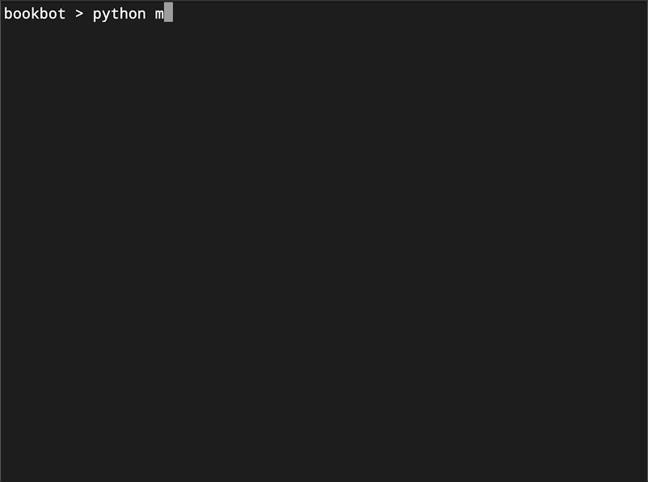
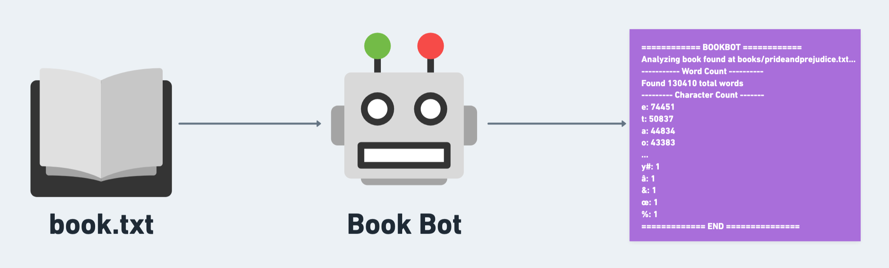

# Book Bot
📖 A command-line tool that analyses book text data and produces a statistical analytics report, written in Python. 



## 🤔 Motivation
📊 You give the program a path to the book text file you want to analyze and it gives you a nice report of word and character count.

## 🎨 System Design


## 🚀 Quick Start

### Install
```bash
git clone https://github.com/shantdashjian/bookbot
```

### Change directory
```bash
cd bookbot
```

### Run with a path to the book you want to analyze
```bash
python3 main.py books/mobydick.txt
```