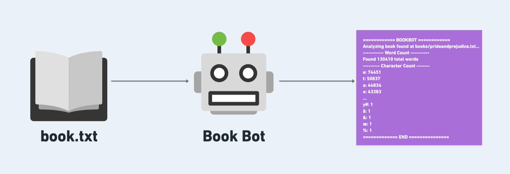

# Book Bot
📖 A command-line tool that analyses book text data and produces a statistical analytics report, written in Python. 

👍 This is my first [Boot.dev](https://www.boot.dev) project!

## In This Document:
  - [System Design](#system-design)
  - [How to Use the Tool](#how-to-use-the-tool)
  - [Technologies Used](#technologies-used)
  - [Brushup Points](#brushup-points)

## System Design


## How to Use the Tool
```
> python3 main.py books/pride-and-prejudice.txt
```
## Technologies Used
1. Python

## Brushup Points
1. Generally speaking, Git is for tracking code, not data. Exceptions apply.
2. Refactoring is the process of improving the quality of your code, without changing its behavior.
3. In `Python`, you could capture the command line arguments passed to your program using `sys.argv`.

