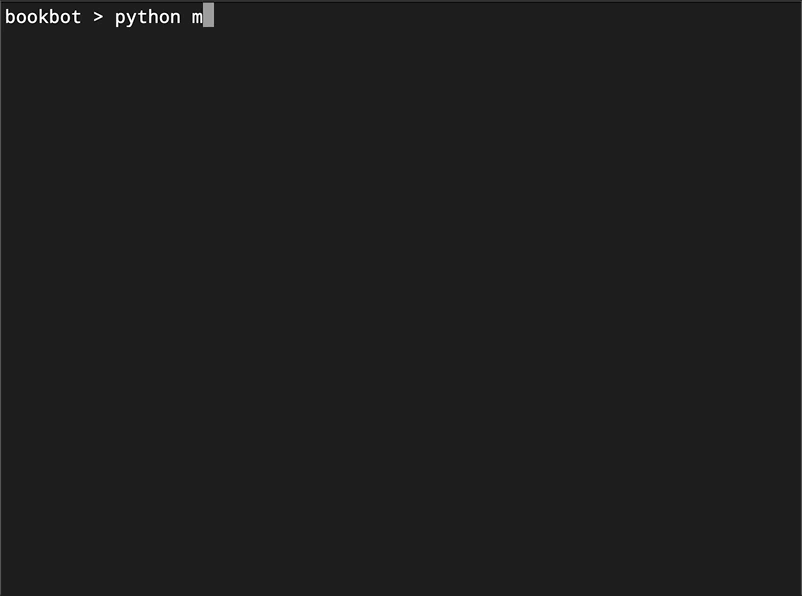
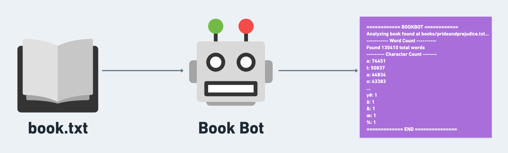

# Book Bot
📖 A command-line tool that analyses book text data and produces a statistical analytics report, written in Python. 



## 📝 In This Document:
- [Motivation](#🤔-motivation)  
- [System Design](#🎨-system-design)
- [Quick Start](#🚀-quick-start)

## 🤔 Motivation
- 👍 This was my first [Boot.dev](https://www.boot.dev) Python project! 
- The goal was to practice using core programming building blocks and data structures. 
- You give the program a path to the book text file you want to analyze and it gives you a nice report of word and character count.

## 🎨 System Design


## 🚀 Quick Start

### Install
```
git clone https://github.com/shantdashjian/bookbot
```

### Change directory
```
cd bookbot
```

### Run with a path to the book you want to analyze
```
python3 main.py books/mobydick.txt
```